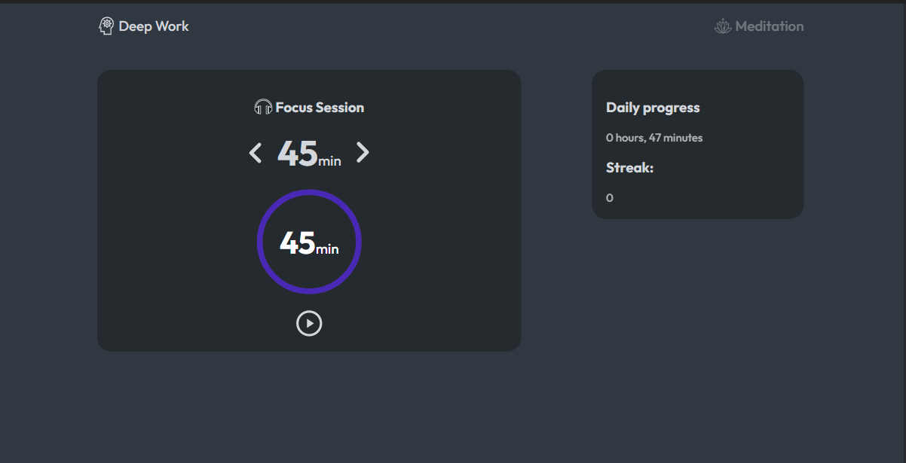

## Table of contents

- [Overview](#overview)
  - [The challenge](#the-challenge)
  - [Screenshot](#screenshot)
  - [Links](#links)
- [My process](#my-process)
  - [Built with](#built-with)
- [Author](#author)

## Overview

### The challange

User should be able to:

- Time their work periods with 5 minute breaks in between sessions
- Toggle between a Meditaion/Deep Work modes
- See hover states for the elements
- Stop the timer
- See their streak of consecutive days with 30+ minutes of deep work

### Screenshot

### Links

- Live URL: [Live URL]()
- GitHub: [GitHub](https://github.com/gabadadzeluca/deepwork-timer);

## My process

### Built With

- Semantic HTML
- SCSS
- Javascript
- Moment.js Module [Moment.js](https://momentjs.com/) 

### Author

- LinkedIn - [Luca Gabadadze](https://www.linkedin.com/in/luca-gabadadze-6068b324a/)

